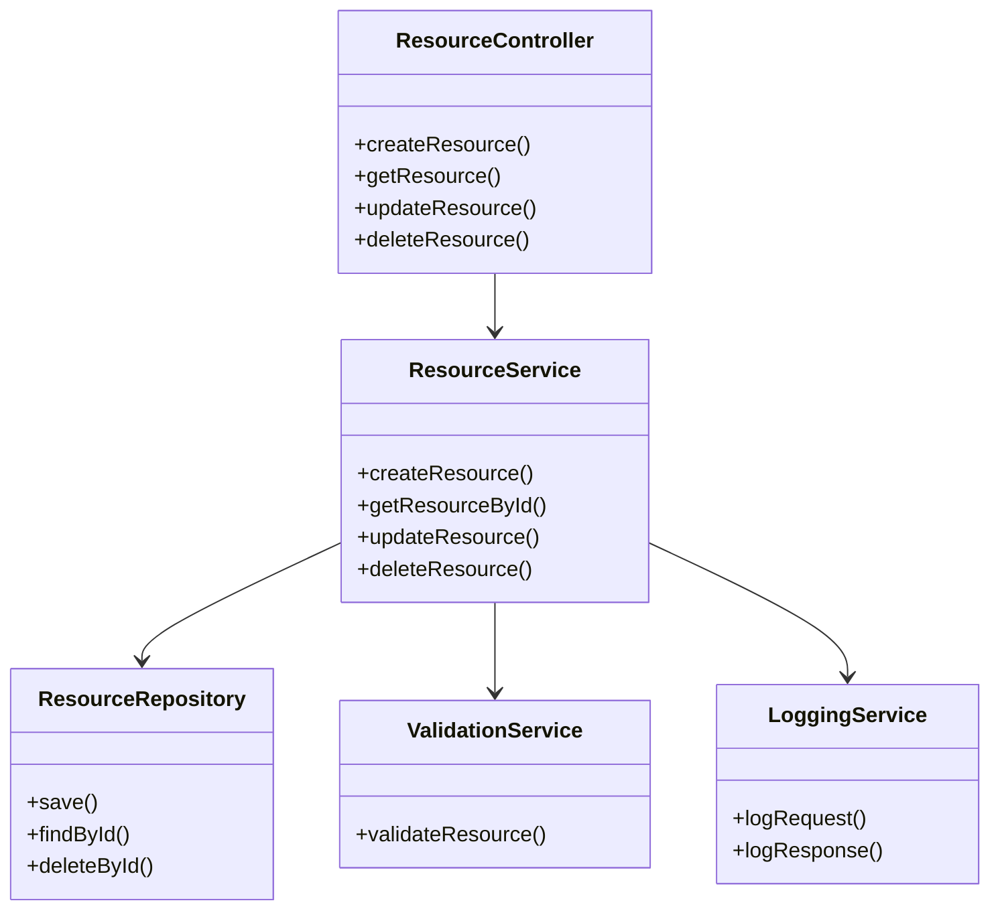
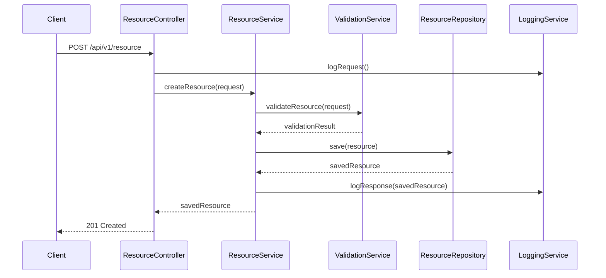
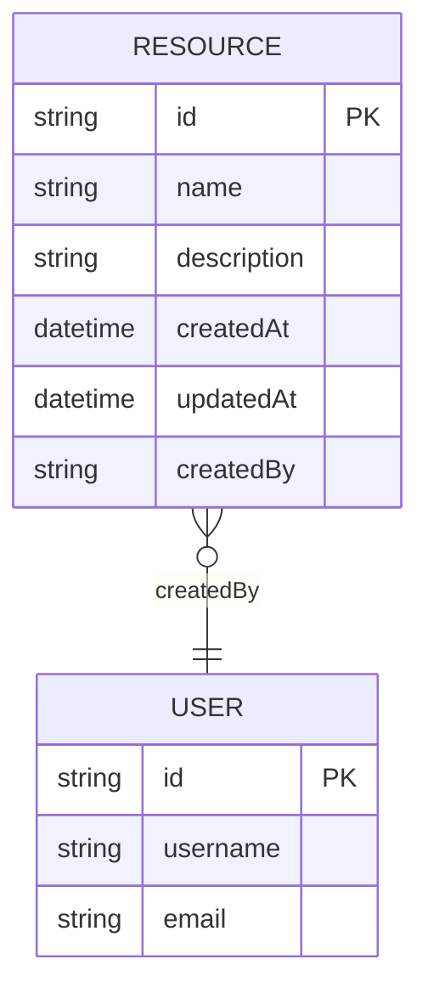

# Low-Level Design (LLD) Document for SCRUM-212

## 1. Objective

Provide a comprehensive low-level design for the SCRUM-212 feature/module. This document outlines the functional and technical details required to implement the solution using Spring Boot, ensuring maintainability, scalability, and adherence to industry best practices.

---

## 2. API Model

### 2.1 Common Components/Services
- **AuthenticationService**: Handles user authentication and authorization.
- **LoggingService**: Centralized logging for audit and debugging.
- **ExceptionHandler**: Global exception handling for REST APIs.
- **ValidationService**: Common input and business validation logic.

### 2.2 API Details

| API Name         | HTTP Method | Endpoint               | Request Body      | Response Body     | Description                  | Auth Required |
|------------------|-------------|------------------------|-------------------|-------------------|------------------------------|---------------|
| CreateResource   | POST        | /api/v1/resource       | ResourceRequest   | ResourceResponse  | Creates a new resource       | Yes           |
| GetResource      | GET         | /api/v1/resource/{id}  | N/A               | ResourceResponse  | Retrieves resource by ID     | Yes           |
| UpdateResource   | PUT         | /api/v1/resource/{id}  | ResourceRequest   | ResourceResponse  | Updates an existing resource | Yes           |
| DeleteResource   | DELETE      | /api/v1/resource/{id}  | N/A               | Void/Status       | Deletes a resource           | Yes           |

### 2.3 API-specific Business Logic, Validations, and Class Details
- **ResourceRequest**: Contains all required fields for resource creation/updation. Fields validated for type, format, and business rules.
- **Business Logic**:
  - Validate mandatory fields are present.
  - Ensure resource uniqueness based on business key.
  - Enforce user permissions for create/update/delete.
  - Log all API transactions.
- **Class Details**:
  - `ResourceController`: REST controller for resource APIs.
  - `ResourceService`: Service layer for business logic.
  - `ResourceRepository`: MongoDB repository interface.

### 2.4 Exceptions

| Exception Name           | HTTP Status | Description                                 |
|-------------------------|-------------|---------------------------------------------|
| ResourceNotFoundException| 404         | Resource with given ID does not exist       |
| ValidationException      | 400         | Input validation failed                     |
| UnauthorizedException    | 401         | User is not authorized                      |
| InternalServerException  | 500         | Unexpected server error                     |

---

## 3. Functional Design

### 3.1 Class Diagram (Mermaid format)

### 3.2 UML Sequence Diagram (Mermaid format)

### 3.3 Components Table

| Component Name      | Description                                 | Technology         |
|--------------------|---------------------------------------------|--------------------|
| ResourceController | REST API controller for resource endpoints   | Spring Boot MVC    |
| ResourceService    | Business logic for resource operations       | Spring Boot        |
| ResourceRepository | MongoDB data access layer                    | Spring Data MongoDB|
| ValidationService  | Common validation logic                      | Custom Java        |
| LoggingService     | Centralized logging utility                  | SLF4J/Logback      |

### 3.4 Service Layer Logic and Validations

| Method                | Validation/Logic Description                                 |
|-----------------------|-------------------------------------------------------------|
| createResource        | Validate input, check uniqueness, save to DB, log action    |
| getResourceById       | Validate ID format, fetch from DB, handle not found         |
| updateResource        | Validate input, check existence, update DB, log action      |
| deleteResource        | Validate ID, check existence, delete from DB, log action    |

### 3.5 Common Libraries Usage
- **Spring Boot Starter Web**: For building RESTful APIs
- **Spring Data MongoDB**: For MongoDB integration
- **SLF4J/Logback**: For logging
- **Spring Boot Starter Validation**: For input validation
- **Spring Security**: For authentication and authorization

---

## 4. Integrations

| Integration Name | Type           | Description                       | Protocol/Format | Endpoint/Details            |
|------------------|----------------|-----------------------------------|-----------------|-----------------------------|
| MongoDB          | Database       | Primary data store                | BSON/JSON       | mongodb://...               |
| Auth Service     | REST API       | User authentication & authorization| JSON            | http://auth-service/api     |
| Logging Service  | Internal/Async | Centralized logging               | JSON/HTTP       | http://logging-service/api  |

---

## 5. MongoDB Details

### 5.1 ER Model (Mermaid format)

### 5.2 MongoDB Field Validations

| Collection | Field       | Type     | Required | Unique | Validation Rules                   |
|------------|-------------|----------|----------|--------|------------------------------------|
| Resource   | id          | String   | Yes      | Yes    | UUID format                        |
| Resource   | name        | String   | Yes      | Yes    | 3-100 chars, alphanumeric          |
| Resource   | description | String   | No       | No     | Max 500 chars                      |
| Resource   | createdAt   | DateTime | Yes      | No     | ISO8601 format                     |
| Resource   | updatedAt   | DateTime | Yes      | No     | ISO8601 format                     |
| Resource   | createdBy   | String   | Yes      | No     | Must reference existing User.id     |

---

## 6. Dependencies
- Java 17+
- Spring Boot 3.x
- Spring Data MongoDB
- Spring Boot Starter Web
- Spring Boot Starter Validation
- Spring Security
- SLF4J/Logback
- JUnit 5, Mockito (for testing)

---

## 7. Assumptions
- All API endpoints are secured and require valid authentication tokens.
- MongoDB is configured with high availability and appropriate indexing.
- All date/time fields use UTC and ISO8601 format.
- User service is available for user existence validation.
- Logging is asynchronous and non-blocking.
- All validations are enforced both at API and database levels.

---

---

**running_instance_id:** 123456
