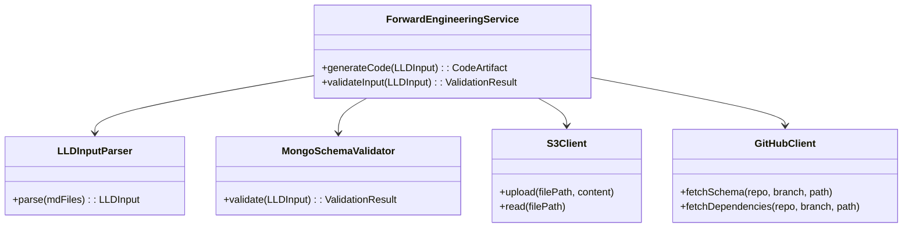
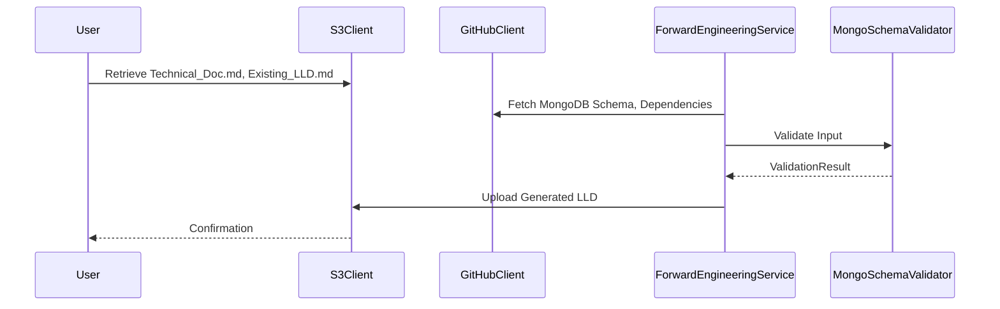

# Low-Level Design (LLD) Document: Forward Engineering - SCRUM-212

## 1. Introduction
This document details the Low-Level Design (LLD) for the Forward Engineering module as per SCRUM-212. It translates technical requirements and structured documentation into production-ready Spring Boot code, ensuring maintainability, scalability, and adherence to best practices.

## 2. Architectural Overview
### 2.1 System Context
The Forward Engineering module integrates with upstream Jira agents, processes structured technical documents, and generates Spring Boot code artifacts. It interacts with MongoDB for persistence and leverages shared libraries for logging, validation, and error handling.

### 2.2 Component Diagram


### 2.3 Sequence Diagram


### 2.4 Design Decisions
- **Spring Boot**: Chosen for rapid development, scalability, and robust ecosystem.
- **MongoDB**: Flexible schema management for evolving requirements.
- **S3 & GitHub Integration**: Ensures seamless retrieval and storage of artifacts and schemas.
- **Validation Layer**: Enforces all schema and business constraints.
- **Common Libraries**: Standardizes logging, error handling, and utility functions.

## 3. Data Model & Validation
### 3.1 MongoDB Schema
```json
{
  "collection": "forward_engineering",
  "fields": [
    { "name": "id", "type": "ObjectId", "required": true },
    { "name": "jira_ticket", "type": "String", "required": true },
    { "name": "ll_d_input", "type": "Object", "required": true },
    { "name": "created_at", "type": "Date", "required": true },
    { "name": "updated_at", "type": "Date", "required": false }
  ]
}
```

### 3.2 Entity Class
```java
@Document(collection = "forward_engineering")
public class ForwardEngineeringEntity {
    @Id
    private ObjectId id;
    @NotBlank
    private String jiraTicket;
    @NotNull
    private LLDInput llDInput;
    @NotNull
    private Date createdAt;
    private Date updatedAt;
    // getters and setters
}
```

### 3.3 Validation Table
| Field         | Constraint         | Validation Annotation | Custom Logic                 |
|---------------|-------------------|----------------------|------------------------------|
| id            | Required          | @Id                  | Auto-generated               |
| jira_ticket   | Required, String  | @NotBlank            | Must match Jira ticket regex |
| ll_d_input    | Required, Object  | @NotNull             | Parsed from input docs       |
| created_at    | Required, Date    | @NotNull             | Set on creation              |
| updated_at    | Optional, Date    |                      | Set on update                |

### 3.4 Validation Logic
- All required fields must be present.
- `jira_ticket` must match pattern: `SCRUM-\d+`.
- `ll_d_input` must be a valid parsed object from input markdown files.
- `created_at` is set at insertion; `updated_at` is updated on modification.

### 3.5 Error Handling
- Invalid input structure: Return HTTP 400 with details.
- Schema validation failure: Return HTTP 422 with error list.
- S3/GitHub connectivity errors: Return HTTP 503 with retry guidance.
- All errors are logged using the common logging library.

## 4. Application Dependencies & Common Libraries
- **Spring Boot Starter Web**: REST API foundation
- **Spring Data MongoDB**: Persistence layer
- **Spring Boot Starter Validation**: Bean validation
- **Lombok**: Boilerplate reduction
- **SLF4J/Logback**: Logging
- **Custom Error Handling Library**: Standardized error responses
- **AWS SDK**: S3 integration
- **GitHub API Client**: Schema and dependency retrieval

## 5. Implementation Details
### 5.1 Core Classes
- `ForwardEngineeringService`: Orchestrates the end-to-end process
- `LLDInputParser`: Parses markdown files into structured input
- `MongoSchemaValidator`: Validates input against schema
- `S3Client`: Handles S3 operations
- `GitHubClient`: Fetches schemas and dependencies

### 5.2 Code Snippets
#### Service Layer
```java
@Service
public class ForwardEngineeringService {
    public CodeArtifact generateCode(LLDInput input) {
        ValidationResult result = mongoSchemaValidator.validate(input);
        if (!result.isValid()) {
            throw new ValidationException(result.getErrors());
        }
        // ...generate code logic...
        return codeArtifact;
    }
}
```
#### Validation Example
```java
public ValidationResult validate(LLDInput input) {
    List<String> errors = new ArrayList<>();
    if (input.getJiraTicket() == null || !input.getJiraTicket().matches("SCRUM-\\d+")) {
        errors.add("Invalid Jira ticket format");
    }
    // ...other validations...
    return new ValidationResult(errors.isEmpty(), errors);
}
```

## 6. Integration Points
- **S3**: For input/output document storage
- **GitHub**: For schema and dependency retrieval
- **MongoDB**: For persistence
- **Common Libraries**: For logging, error handling, and validation

## 7. Output Format
- All generated code and artifacts follow Spring Boot conventions
- LLD output is Markdown, with embedded Mermaid diagrams and validation tables
- Error responses are JSON, using the common error format

## 8. Logging
- All operations are logged with context (operation, status, error details)
- S3 upload/download, GitHub fetches, and validation steps are logged

## 9. Appendix
### 9.1 Glossary
- **LLD**: Low-Level Design
- **S3**: Amazon Simple Storage Service
- **Jira**: Issue tracking system
- **Mermaid**: Diagramming syntax for Markdown

### 9.2 References
- [Spring Boot Best Practices](https://spring.io/guides)
- [MongoDB Schema Validation](https://docs.mongodb.com/manual/core/schema-validation/)
- [Mermaid Documentation](https://mermaid-js.github.io/mermaid/#/)
