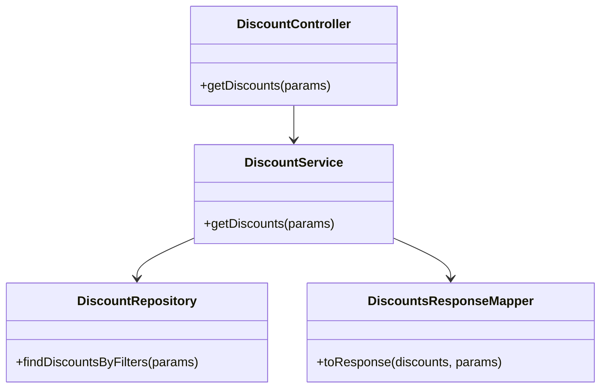
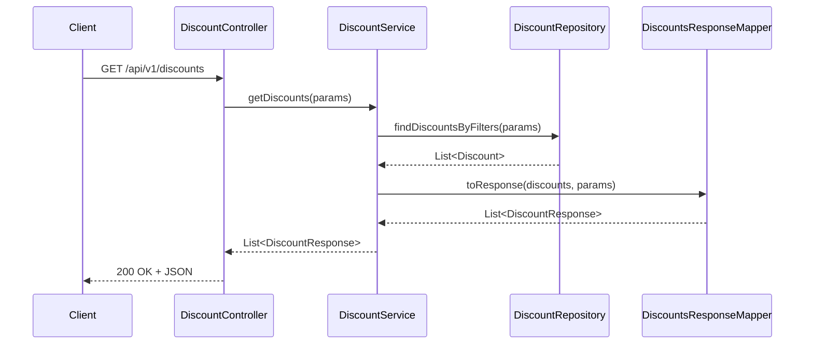
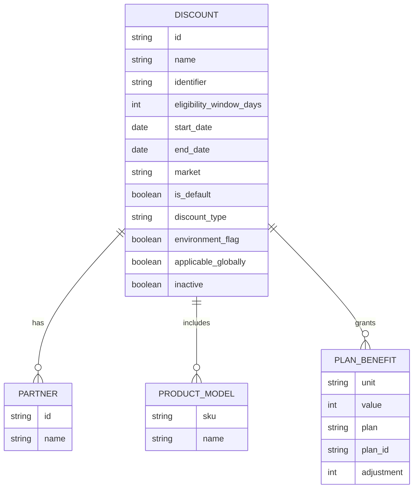

# Low-Level Design (LLD) Document for Discount Management Microservice

**Running Instance ID:** 123456

## 1. Objective

Implement the `GET /api/v1/discounts` endpoint for the Discount Management microservice, enabling consumers to retrieve discount configurations with advanced filtering, business logic, and validations, matching the legacy system's behavior. This LLD is generated based on the provided Technical Document. MongoDB schema and application knowledgebase were unavailable at generation time; all field and validation logic are derived from the technical specification.

## 2. API Model

### 2.1 Common Components
- **Authentication:** Bearer JWT token required in Authorization header.
- **Error Handling:** Standardized error responses for validation and authentication failures.

### 2.2 API Details Table
| Method | Endpoint             | Controller Action           | Auth Required | Description                             |
|--------|----------------------|-----------------------------|--------------|-----------------------------------------|
| GET    | /api/v1/discounts    | DiscountController#getDiscounts | Yes          | Retrieve discounts with filtering options |

**Query Parameters:**
- `market` (string, optional): Filter by market name
- `identifier` (string, optional): Filter by discount identifier
- `environment_flag` (boolean, optional): Filter by environment flag
- `productSku` (string, optional): Filter by product SKU (requires market)
- `expired` (boolean, optional): Include expired discounts

### 2.3 API-specific Business Logic
- Authenticate request via Bearer JWT token.
- If `productSku` is present and `market` is blank, respond with HTTP 400 and message "Market is required".
- Apply all filtering parameters to the Discount entity.
- Only return discounts where `end_date > current UTC time` and `inactive == false` unless `expired=true`.
- Serialize each discount according to the response schema.

### 2.4 Exceptions Table
| HTTP Status | Condition                                 | Message              |
|------------|-------------------------------------------|----------------------|
| 400        | productSku present, market missing        | Market is required   |
| 401        | Authentication fails                      | Unauthorized         |
| 200        | No discounts match filters                | [] (empty array)     |

## 3. Functional Design

### 3.1 Class Diagram (Mermaid)

### 3.2 UML Sequence Diagram (Mermaid)

### 3.3 Components Table
| Component                  | Responsibility                                                  |
|----------------------------|-----------------------------------------------------------------|
| DiscountController         | Handles HTTP requests, authentication, validation                |
| DiscountService            | Implements business logic and filtering                          |
| DiscountRepository         | Data access, filtering, and query execution                      |
| DiscountsResponseMapper    | Maps Discount entities to API response format                    |

### 3.4 Service Layer Logic and Validations Table
| Field                       | Validation/Rule                                  | Error Message/Handling                |
|-----------------------------|--------------------------------------------------|---------------------------------------|
| name                        | Required, unique within market_id                | 400 Bad Request                       |
| identifier                  | Required, unique within market_id, alphanumeric  | 400 Bad Request, "must be alphanumeric" |
| market_id                   | Required                                         | 400 Bad Request                       |
| start_date                  | Required, must be before end_date                | 400 Bad Request, "must be before end date" |
| end_date                    | Required                                         | 400 Bad Request                       |
| discount_type               | Enum: product_only, service_only, product_and_service | 400 Bad Request                  |
| applicable_globally         | Boolean                                          | 400 Bad Request                       |
| inactive                    | Boolean                                          | 400 Bad Request                       |
| partners                    | Empty if applicable_globally=true; present otherwise | 400 Bad Request                   |
| plan_benefits               | All plans must belong to same market              | 400 Bad Request                       |
| productSku + market         | If productSku present, market required           | 400 Bad Request, "Market is required" |

### 3.5 Common Libraries Usage
- **Spring Boot Starter Web:** REST controller and HTTP request handling
- **Spring Boot Starter Security:** JWT Bearer authentication
- **Spring Data MongoDB:** Repository and query abstraction (assumed, as per microservice context)
- **Lombok:** Boilerplate code reduction (getters, setters, etc.)
- **Validation API (javax.validation):** Field-level validations (e.g., @NotNull, @Pattern, @Size, @Unique)

## 4. Integrations Table
| External System        | Integration Type      | Purpose                                  |
|-----------------------|----------------------|------------------------------------------|
| Authentication Service| REST (JWT Bearer)    | Validates and authenticates requests     |
| MongoDB               | Spring Data MongoDB  | Stores and retrieves Discount entities   |

## 5. MongoDB Details

**Note:** MongoDB schema file was not available; field structure and validations are based on the Technical Document.

### 5.1 ER Model (Mermaid)

### 5.2 MongoDB Field Validations Table
| Field                   | Type     | Validation/Rule                                  |
|-------------------------|----------|--------------------------------------------------|
| id                      | string   | Auto-generated                                   |
| name                    | string   | Required, unique within market                   |
| identifier              | string   | Required, unique within market, alphanumeric     |
| eligibility_window_days | int      | Optional                                         |
| start_date              | date     | Required, must be before end_date                |
| end_date                | date     | Required                                         |
| market                  | string   | Required                                         |
| is_default              | boolean  | Optional                                         |
| discount_type           | string   | Enum: product_only, service_only, product_and_service |
| environment_flag        | boolean  | Optional                                         |
| applicable_globally     | boolean  | Required                                         |
| inactive                | boolean  | Required                                         |
| partners                | array    | Empty if applicable_globally=true, present otherwise |
| product_models          | array    | Optional                                         |
| plan_benefits           | array    | All plans must belong to same market              |

## 6. Dependencies
- Spring Boot Starter Web
- Spring Boot Starter Security
- Spring Data MongoDB
- Lombok
- Javax Validation API

## 7. Assumptions
- MongoDB schema and application knowledgebase were not available at LLD generation time; all field and validation logic is inferred from the technical specification.
- Discount entity is stored in a MongoDB collection named `discounts`.
- All referenced entities (partners, product_models, plan_benefits) are embedded documents within the Discount collection.
- JWT authentication is handled by a shared authentication service.
- All error messages and validation rules are enforced as described above.
